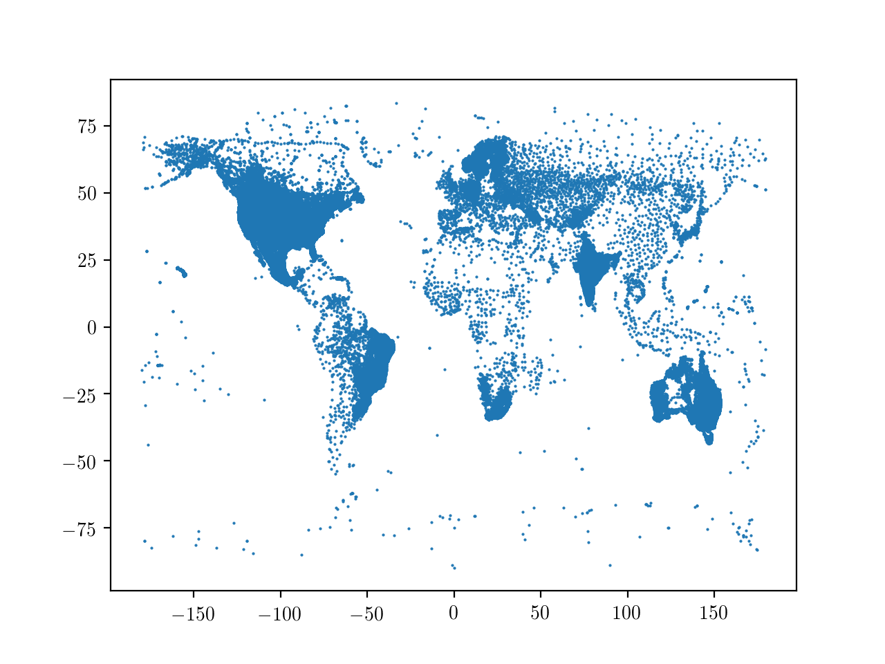
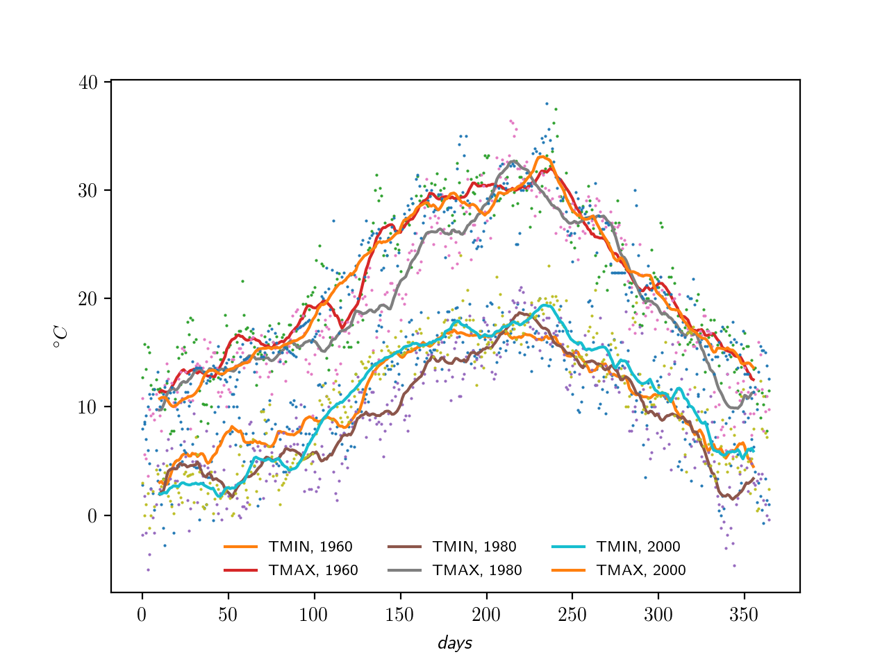

# Weather-data-and-time-series

*Example time-series analysis portfolio*

## Introduction
We collect weather data from [NOAA](https://www.noaa.gov/) and use the integrated [GHCN-Daily](https://www.ncdc.noaa.gov/ghcn-daily-description) database of daily climate summaries from stations across the globe. This means looking at variables such as the minimum and maximum temperatures, the total precipitations, and so on.
We download a list of stations and use it to locate temperature data for different cities. We manage missing values and smooth time series in order to enhance the information out of the noise. Finally, we create some visualisations of daily temperatures.

## The database
By plotting longitude against latitude, we can get a feel of the global coverage of the database.

## Dealing with missing information
Next, we should face the problem of making sense of missing values in the database. This is a common aspect in data analysis and actually we could just ignore them. If we do need an uninterrupted series of numbers, we could set the missing entries, for istance, to the average of the respective column. A more sophisticated approach to restore missing values is given by [interpolation](https://numpy.org/doc/stable/reference/generated/numpy.interp.html), which selects the "good" data points and returns estimated values for the missing ones, that are interpolated linearly by fitting segments between existing data points. Here we follow this approach, which is actually rather conservative, hence intrinsically safe.

## Dealing with noise
A Time series is a sequence of values organised chronologically, usually with equal cadence.
Looking directly at the data from the series is informative, but one may see lots of noise in the form of rapid variations between one day and the next; this may result in covering up underlying trends. To limit the noise, one can smooth the data. The premise of data smoothing is that one is measuring a variable that is both slowly varying and also corrupted by random noise, so that smoothing (*i*) increases the signal-to-noise ratio and (*ii*) exposes the slow, long-term behaviour underneath the oscillations.
We follow a simple, direct approach to smoothing by replacing each value with the average of a set of its neighbours. Indeed, since nearby points measure very nearly the same underlying value, averaging can reduce the level of noise without (much) biasing the value obtained. Here we use a so-called "box filter": a smoothing mask with positive, normalised entries that add up to 1. To this end, it proves useful to use [cross-correlation](https://numpy.org/doc/stable/reference/generated/numpy.correlate.html).
We try this out, for instance, over multiple years for Roma Ciampino, an international airport just outside Rome, to check if the climate is stable. Quite so.

*Fig: stocazzo*
